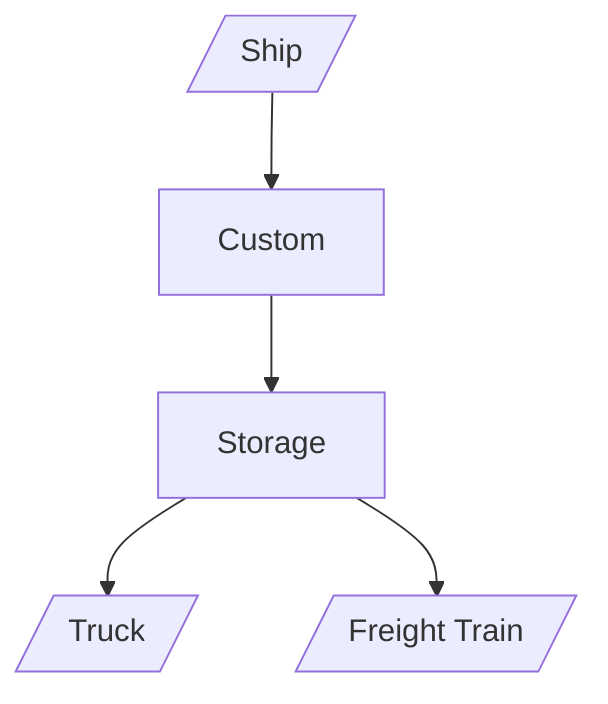

# I. Port WorkFlow Simulation

## I-1 (Stage-One) Flow Chart

Offload WorkFlow

## I-2 Objects

ship : 
- preflight request
- dock to port
- unload freight
- load freight

port : 
- handle preflight request
- request vehicles to move containers
- know all information about containers' location

vehicle : 
- have a lock
- handle request from port
- move containers from storage place
    - request storage place
    - lock itself
    - lock the container stack
    - load the container
    - release the container stack
- move itself

container : 
- have a lock

storage place : 
- reject or accept requests from vehicles
    - accept: lock the container
    - reject: do nothing
- consists of several container stacks