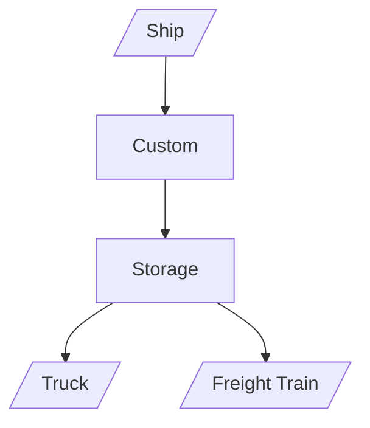

# I. Port WorkFlow Simulation

## I-1 (Stage-One) Flow Chart

Offload WorkFlow

```mermaid
graph TD;

Ship[/"Ship"/]
Custom["Custom"]
Storage["Storage"]
Truck[/"Truck"/]
Train[/"Freight Train"/]

Ship-->Custom
Custom-->Storage
Storage-->Truck
Storage-->Train
```

